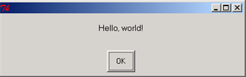
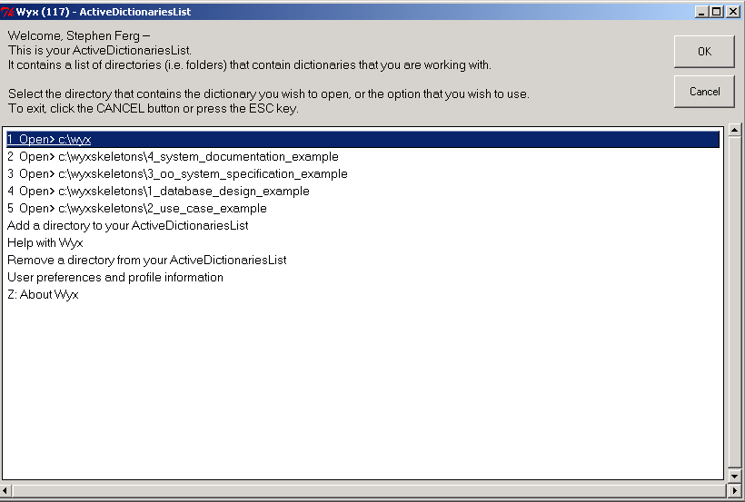
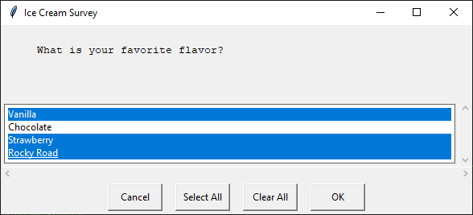

EasyGui Tutorial
================

.. toctree::
   :maxdepth: 4

Introduction
------------
In easygui, all GUI interactions are invoked by simple function calls.

Here is a simple demo program using easygui.

.. doctest::

    from easygui import *
    import sys

    # A nice welcome message
    ret_val = msgbox("Hello, World!")
    if ret_val is None: # User closed msgbox
        sys.exit(0)

    msg ="What is your favorite flavor?\nOr Press <cancel> to exit."
    title = "Ice Cream Survey"
    choices = ["Vanilla", "Chocolate", "Strawberry", "Rocky Road"]
    while 1:
        choice = choicebox(msg, title, choices)
        if choice is None:
            sys.exit(0)
        msgbox("You chose: {}".format(choice), "Survey Result")

EasyGui's demonstration routine
-------------------------------
To run EasyGui's demonstration routine, invoke EasyGui from the command line this way::

    python easygui.py

or from an IDE (such as IDLE, PythonWin, Wing, etc.) this way::

    from easygui import *
    egdemo()

This will allow you to try out the various EasyGui functions,
and will print the results of your choices to the console.

Importing EasyGui
-----------------
In order to use EasyGui, you must import it. The simplest import statement is::

    import easygui

If you use this form, then to access the EasyGui functions, you must prefix them with the name "easygui", this way::

    easygui.msgbox(...)

One alternative is to import EasyGui this way::

    from easygui import *

This makes it easier to invoke the EasyGui functions; you won't have to prefix the function names with "easygui". You can just code something like this::

    msgbox(...)

A third alternative is to use something like the following import statement::

    import easygui as g

This allows you to keep the EasyGui namespace separate with a minimal amount of typing. You can access easgui functions like this::

    g.msgbox(...)

This third alterative is actually the best way to do it once you get used to python and easygui.

Using EasyGui
-------------
Once your module has imported EasyGui, GUI operations are a simple a matter of invoking EasyGui functions with a few parameters. For example, using EasyGui, the famous "Hello, world!" program looks like this::

    from easygui import *
    msgbox("Hello, world!")

To see a demo of what EasyGui output looks like, invoke easyGui from the command line, this way::

    python easygui.py

To see examples of code that invokes the EasyGui functions, look at the demonstration code at the end of easygui.py.

Default arguments for EasyGui functions
---------------------------------------
For all of the boxes, the first two arguments are for message and title,
in that order. In some cases, this might not be the most user-friendly
arrangement (for example, the dialogs for getting directory and filenames
ignore the message argument), but I felt that keeping this consistent
across all widgets was a consideration that is more important.

Most arguments to EasyGui functions have defaults.
Almost all of the boxes display a message and a title. The title defaults
to the empty string, and the message usually has a simple default.

This makes it is possible to specify as few arguments as you need in order to
get the result that you want. For instance, the title argument to msgbox
is optional, so you can call msgbox specifying only a message, this way::

    msgbox("Danger, Will Robinson!")

or specifying a message and a title, this way::

    msgbox("Danger, Will Robinson!", "Warning!")

On the various types of buttonbox, the default message is "Shall I continue?",
so you can (if you wish) invoke them without arguments at all. Here we
invoke ccbox (the close/cancel box, which returns a boolean value) without
any arguments at all::

    if ccbox():
        pass  # user chose to continue
    else:
        return      # user chose to cancel

Using keyword arguments when calling EasyGui functions
------------------------------------------------------
It is possible to use keyword arguments when calling EasyGui functions.

Suppose for instance that you wanted to use a buttonbox, but
(for whatever reason) did not want to specify the title (second) positional
argument. You could still specify the choices argument (the third argument)
using a keyword, this way::

    choices = ["Yes","No","Only on Friday"]
    reply = choicebox("Do you like to eat fish?", choices=choices)

Using buttonboxes
-----------------
There are a number of functions built on top of buttonbox() for common needs.

msgbox
^^^^^^
msgbox displays a message and offers an OK button. You can send whatever message you want, along with whatever title you want. You can even over-ride the default text of "OK" on the button if you wish. Here is the signature of the msgbox function::

    def msgbox(msg="(Your message goes here)", title="", ok_button="OK"):
        ....

The clearest way to over-ride the button text is to do it with a keyword
argument, like this::

    msgbox("Backup complete!", ok_button="Good job!")

Here are a couple of examples::

    msgbox("Hello, world!")

::

    msg = "Do you want to continue?"
    title = "Please Confirm"
    if ccbox(msg, title):     # show a Continue/Cancel dialog
        pass  # user chose Continue
    else:  # user chose Cancel
        sys.exit(0)

.. image:: _static/tutorial//screenshot_ccbox.png
   :align: center

ccbox
^^^^^
ccbox offers a choice of Continue and Cancel, and returns either True (for continue) or False (for cancel).

ynbox
^^^^^
ynbox offers a choice of Yes and No, and returns either True of False.

buttonbox
^^^^^^^^^
To specify your own set of buttons in a buttonbox, use the buttonbox() function.

The buttonbox can be used to display a set of buttons of your choice. When the user clicks on a button, buttonbox() returns the text of the choice. If the user cancels or closes the buttonbox, the default choice (the first choice) is returned.

buttonbox displays a message, a title, and a set of buttons. Returns the text of the button that the user selected.

indexbox
^^^^^^^^
indexbox displays a message, a title, and a set of buttons. Returns the index of the user's choice. For example, if you invoked index box with three choices (A, B, C), indexbox would return 0 if the user picked A, 1 if he picked B, and 2 if he picked C.

boolbox
^^^^^^^
boolbox (boolean box) displays a message, a title, and a set of buttons. Returns returns 1 if the first button is chosen. Otherwise returns 0.

Here is a simple example of a boolbox()::

    message = "What does she say?"
    title = ""
    if boolbox(message, title, ["She loves me", "She loves me not"]):
        sendher("Flowers") # This is just a sample function that you might write.
    else:
        pass

How to show an image in a buttonbox
-----------------------------------
When you invoke the buttonbox function (or other functions that display a button box, such as msgbox, indexbox, ynbox,
 etc.), you can specify the keyword argument image=xxx where xxx is the filename of an image.  The file can be .gif.
Usually, you can use other image formats such as .png.

.. note::
  The types of files supported depends on how you installed python.  If other formats don't work, you may need to install the PIL library.

If an image argument is specified, the image file will be displayed after the message.

Here is some sample code from EasyGui's demonstration routine::

    image = "python_and_check_logo.gif"
    msg = "Do you like this picture?"
    choices = ["Yes","No","No opinion"]
    reply = buttonbox(msg, image=image, choices=choices)

If you click on one of the buttons on the bottom, its value will be returned in 'reply'.  You may also click on the image.
In that case, the image filename is returned.

.. image:: _static/tutorial/screenshot_buttonbox_with_image.png
   :align: center

Letting the user select from a list of choices
----------------------------------------------
choicebox
^^^^^^^^^

Buttonboxes are good for offering the user a small selection of short choices. But if there are many choices, or the text of the choices is long, then a better strategy is to present them as a list.

choicebox provides a way for a user to select from a list of choices. The choices are specified in a sequence (a tuple or a list). The choices will be given a case-insensitive sort before they are presented.

The keyboard can be used to select an element of the list.

Pressing "g" on the keyboard, for example, will jump the selection to the first element beginning with "g". Pressing "g" again, will jump the cursor to the next element beginning with "g". At the end of the elements beginning with "g", pressing "g" again will cause the selection to wrap around to the beginning of the list and jump to the first element beginning with "g".

If there is no element beginning with "g", then the last element that occurs before the position where "g" would occur is selected. If there is no element before "g", then the first element in the list is selected::

    msg ="What is your favorite flavor?"
    title = "Ice Cream Survey"
    choices = ["Vanilla", "Chocolate", "Strawberry", "Rocky Road"]
    choice = choicebox(msg, title, choices)

.. image:: _static/tutorial/screenshot_choicebox_icecream.png
   :align: center

Another example of a choicebox:

multchoicebox
^^^^^^^^^^^^^
The multchoicebox() function provides a way for a user to select from a list of choices. The interface looks just like the choicebox, but the user may select zero, one, or multiple choices.

The choices are specified in a sequence (a tuple or a list). The choices will be given a case-insensitive sort before they are presented.

Letting the user enter information
----------------------------------
enterbox
^^^^^^^^
enterbox is a simple way of getting a string from the user

integerbox
^^^^^^^^^^
integerbox is a simple way of getting an integer from the user.

multenterbox
^^^^^^^^^^^^
multenterbox is a simple way of showing multiple enterboxes on a single screen.

.. image:: _static/tutorial//screenshot_multenterbox_vista.png
   :align: center

In the multenterbox:

  - If there are fewer values than names, the list of values is padded with empty strings until the number of values is the same as the number of names.

  - If there are more values than names, the list of values is truncated so that there are as many values as names.

Returns a list of the values of the fields, or None if the user cancels the operation.

Here is some example code, that shows how values returned from multenterbox can be checked for validity before they are accepted::

    from __future__ import print_function
    msg = "Enter your personal information"
    title = "Credit Card Application"
    fieldNames = ["Name", "Street Address", "City", "State", "ZipCode"]
    fieldValues = multenterbox(msg, title, fieldNames)
    if fieldValues is None:
        sys.exit(0)
    # make sure that none of the fields were left blank
    while 1:
        errmsg = ""
        for i, name in enumerate(fieldNames):
            if fieldValues[i].strip() == "":
              errmsg += "{} is a required field.\n\n".format(name)
        if errmsg == "":
            break # no problems found
        fieldValues = multenterbox(errmsg, title, fieldNames, fieldValues)
        if fieldValues is None:
            break
    print("Reply was:{}".format(fieldValues))

.. note::
  The first line 'from __future__' is only necessary if you are using Python 2.*, and is only needed for this demo.

Letting the user enter password information
-------------------------------------------
passwordbox
^^^^^^^^^^^
A passwordbox box is like an enterbox, but used for entering passwords. The text is masked as it is typed in.

multpasswordbox
^^^^^^^^^^^^^^^
multpasswordbox has the same interface as multenterbox, but when it is displayed, the last of the fields is assumed to be a password, and is masked with asterisks.

.. image:: _static/tutorial/screenshot_passwordbox.png
   :align: center

Displaying text
---------------
EasyGui provides functions for displaying text.

textbox
^^^^^^^
The textbox() function displays text in a proportional font. The text will word-wrap.

codebox
^^^^^^^
The codebox() function displays text in a monospaced font and does not wrap.

.. image:: _static/tutorial/screenshot_codebox_vista.png
   :align: center

Note that you can pass codebox() and textbox() either a string or a list of strings. A list of strings will be converted to text before being displayed. This means that you can use these functions to display the contents of a file this way::

    import os
    filename = os.path.normcase("c:/autoexec.bat")
    f = open(filename, "r")
    text = f.readlines()
    f.close()
    codebox("Contents of file " + filename, "Show File Contents", text)

Working with files
------------------
A common need is to ask the user for a filename or for a directory. EasyGui provides a few basic functions for allowing a user to navigate through the file system and choose a directory or a file. (These functions are wrappers around widgets and classes in lib-tk.)

Note that in the current version of EasyGui, the startpos argument is not supported.

diropenbox
^^^^^^^^^^
diropenbox returns the name of a directory

fileopenbox
^^^^^^^^^^^
fileopenbox returns the name of a file

.. image:: _static/tutorial/screenshot_fileopenbox_vista.png
   :align: center

filesavebox
^^^^^^^^^^^
filesavebox returns the name of a file

Remembering User Settings
-------------------------

EgStore
^^^^^^^
A common need is to ask the user for some setting, and then to "persist it", or store it on disk, so that the next time the user uses your application, you can remember his previous setting.

In order to make the process of storing and restoring user settings, EasyGui provides a class called EgStore. In order to remember some settings, your application must define a class (let's call it Settings, although you can call it anything you want) that inherits from EgStore.

Your application must also create an object of that class (let's call the object settings).

The constructor (the __init__ method) of the Settings class can initialize all of the values that you wish to remember.

Once you have done this, you can remember the settings simply by assigning values to instance variables in the settings object, and use the settings.store() method to persist the settings object to disk.

Here is an example of code using the Settings class::
    
    from easygui import EgStore

    # -----------------------------------------------------------------------
    # define a class named Settings as a subclass of EgStore
    # -----------------------------------------------------------------------
    class Settings(EgStore):

        def __init__(self, filename):  # filename is required
            # -------------------------------------------------
            # Specify default/initial values for variables that
            # this particular application wants to remember.
            # -------------------------------------------------
            self.userId = ""
            self.targetServer = ""

            # -------------------------------------------------
            # For subclasses of EgStore, these must be
            # the last two statements in  __init__
            # -------------------------------------------------
            self.filename = filename  # this is required
            self.restore()

    # Create the settings object.
    # If the settingsFile exists, this will restore its values
    # from the settingsFile.
    # create "settings", a persistent Settings object
    # Note that the "filename" argument is required.
    # The directory for the persistent file must already exist.

    settingsFilename = "settings.txt"
    settings = Settings(settingsFilename)

    # Now use the settings object.
    # Initialize the "user" and "server" variables
    # In a real application, we'd probably have the user enter them via enterbox
    user    = "obama_barak"
    server  = "whitehouse1"

    # Save the variables as attributes of the "settings" object
    settings.userId = user
    settings.targetServer = server
    settings.store()    # persist the settings
    print("\nInitial settings")
    print settings

    # Run code that gets a new value for userId
    # then persist the settings with the new value
    user    = "biden_joe"
    settings.userId = user
    settings.store()
    print("\nSettings after modification")
    print settings

    # Delete setting variable
    del settings.userId
    print("\nSettings after deletion of userId")
    print settings

Here is an example of code using a dedicated function to create the Settings class::

    from easygui import read_or_create_settings

    # Create the settings object.
    settings = read_or_create_settings('settings1.txt')

    # Save the variables as attributes of the "settings" object
    settings.userId = "obama_barak"
    settings.targetServer = "whitehouse1"
    settings.store()    # persist the settings
    print("\nInitial settings")
    print settings

    # Run code that gets a new value for userId
    # then persist the settings with the new value
    user    = "biden_joe"
    settings.userId = user
    settings.store()
    print("\nSettings after modification")
    print settings

    # Delete setting variable
    del settings.userId
    print("\nSettings after deletion of userId")
    print settings

Trapping Exceptions
-------------------
exceptionbox
^^^^^^^^^^^^
Sometimes exceptions are raised... even in EasyGui applications. Depending on how you run your application, the stack trace might be thrown away, or written to stdout while your application crashes.

EasyGui provides a better way of handling exceptions via exceptionbox. Exceptionbox displays the stack trace in a codebox and may allow you to continue processing.

Exceptionbox is easy to use. Here is a code example::

    try:
        someFunction()  # this may raise an exception
    except:
        exceptionbox()

.. image:: _static/tutorial/screenshot_exceptionbox_vista.png
   :align: center

